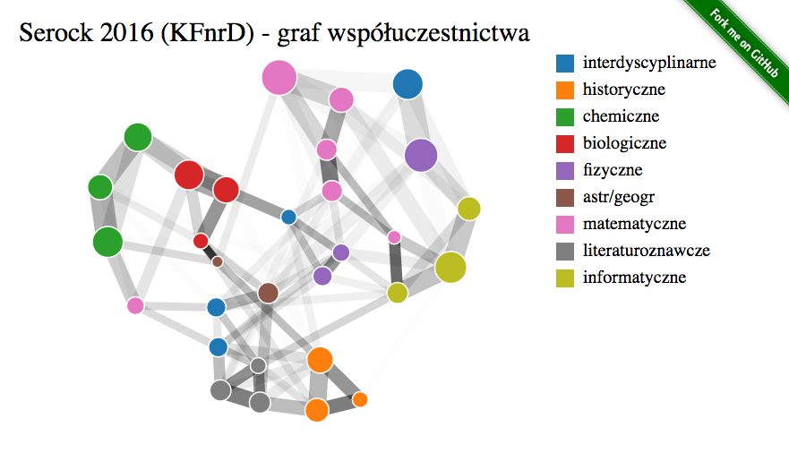

# kfnrd-viz-serock2016

* Interaktywna symulacja: [p.migdal.pl/kfnrd-viz-serock2016](http://p.migdal.pl/kfnrd-viz-serock2016/)
* Autor: [Piotr Migdał](http://p.migdal.pl/), na podstawie danych [Krajowego Funduszu na rzecz Dzieci](http://fundusz.org/).
* Podobny projekt: [TagOverflow](http://p.migdal.pl/tagoverflow/)
* Więcej o KFnrD: [Helping exceptionally gifted children in Poland](http://crastina.se/gifted-children-in-poland-by-piotr-migdal/)

Zapraszam do edycji, zmian, używania do własnych projektów itd! :)

